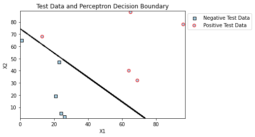
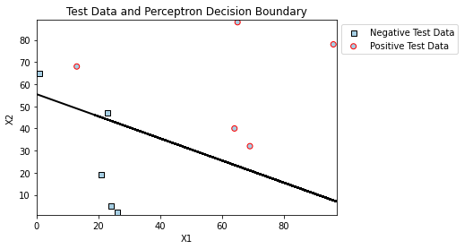

This repo contains the code base for the Perceptron Learning Algorithm.

The problem details can be found [here](https://baylor.kattis.com/courses/CSI5325/20s/assignments/kwne7w/problems/baylor.perceptron).

The algorithm is very sensitive to the random seed selected.

The weights that should give testing_accuracy = 100% are w = [-149.0,2.0,2.0]. The corresponding decision bounday is:

I set the random seed to 0 and obtained the following results: 
- learned weights = [-222.0,2.0,4.0]
- training accuracy = 100%
- testing accuracy = 80%

Below, a 2D visualization of the learned decision boundary and test data:

**I used two libraries: numpy and matplotlib for visualization.**
